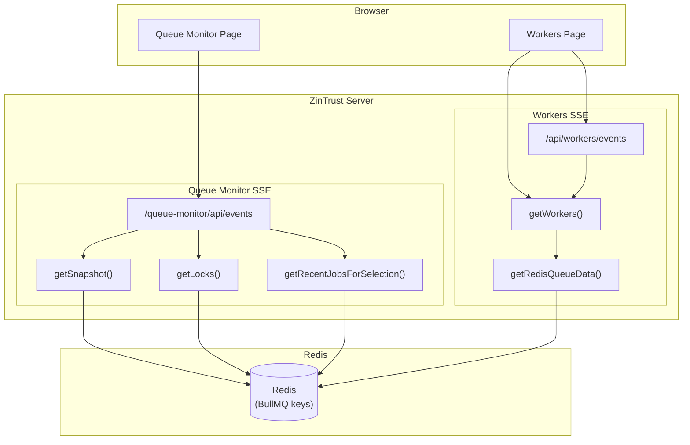

# Redis Request Analysis: `/queue-monitor` and `/workers` Dashboards

> **Date**: 2026-06-28
> **Context**: 18 queues registered. Both dashboards loaded simultaneously. Each dashboard uses SSE polling at 5-second intervals.

---

## 1. Summary

When both the `/queue-monitor` and `/workers` dashboards are open simultaneously, the system issues **~439 logical Redis operations on initial load** and **~205 Redis round-trips every 5 seconds** thereafter (BullMQ uses Lua scripts via `EVAL` to batch operations into single round-trips). This is driven primarily by two independent SSE polling loops that re-query Redis for queue job counts, recent jobs, lock analytics, and worker metadata — with no shared cache across dashboards.

---

## 2. Architecture Overview



---

## 3. Detailed Call Trees

### 3.1 `/queue-monitor` SSE Poll (every 5 seconds)

The frontend opens an `EventSource` to `/queue-monitor/api/events`. Each poll executes `buildSnapshotPayload()` which runs three independent data fetches:

#### A. `getSnapshot()` — Queue Job Counts

```typescript
// packages/queue-monitor/src/index.ts → createGetSnapshot()
const queues = [...]; // 18 resolved queue names
const stats = await driver.getJobCountsMany(queues);
```

`getJobCountsMany()` iterates over all 18 queues, calling BullMQ's `Queue.getJobCounts()` per queue:

```
// packages/queue-monitor/src/driver.ts → createBullMQGetJobCountsMany()
await Promise.all(
  uniqueQueueNames.map(async (name) => {
    const counts = await getJobCounts(name);
    return { name, counts };
  })
);
```

**BullMQ's `getJobCounts()` uses ~6 logical Redis operations per queue** (in BullMQ v5+, via an internal Lua script that executes in a single round-trip). The repo's `QueueCounts` models 6 states:
| Redis Command | Key Pattern | Purpose |
|---|---|---|
| `LLEN` | `bull:{queue}:wait` | Waiting jobs count (list) |
| `LLEN` | `bull:{queue}:active` | Active jobs count (list) |
| `ZCARD` | `bull:{queue}:completed` | Completed jobs count (sorted set) |
| `ZCARD` | `bull:{queue}:failed` | Failed jobs count (sorted set) |
| `ZCARD` | `bull:{queue}:delayed` | Delayed jobs count (sorted set) |
| `ZCARD` | `bull:{queue}:paused` | Paused jobs count (sorted set) |

> **Note**: The per-command breakdown above is illustrative, not measured. BullMQ runs `getJobCounts()` as a single Lua script (`EVAL`), so all logical commands execute in one Redis round-trip per queue.

**Redis commands**: 18 queues × 1 `EVAL` = **~18 round-trips** (logically ~108 operations inside scripts)

#### B. `getLocks(pattern='*')` — Lock Analytics

```typescript
// packages/queue-monitor/src/index.ts → createGetLocks()
const keys = await scanLockKeys(client, searchPattern, MAX_LOCK_KEYS); // SCAN
const statuses = await getLockStatuses(client, keys); // N × PTTL
const metrics = await calculateLockMetrics(client, prefix_lock); // MGET (3 keys)
const histogram = buildLockHistogram(locks); // in-memory only
```

| Operation          | Redis Commands | Notes                                                          |
| ------------------ | -------------- | -------------------------------------------------------------- |
| `SCAN` cursor loop | ~1–5 `SCAN`    | Depends on total keys in Redis                                 |
| `PTTL` per key     | ~N             | N = number of lock keys found                                  |
| `MGET` metrics     | 1              | `MGET {prefix}:attempts {prefix}:acquired {prefix}:collisions` |

**Redis commands**: ~5–50 (depends on lock volume; typically ~10–25 for moderate usage)

#### C. `getRecentJobsForSelection('__all__')` — Recent Jobs

When the queue selector is set to "All queues" (default):

```typescript
// QueueMonitoringService.ts → getRecentJobsForSelection()
const names = [...]; // all 18 queue names
const jobsByQueue = await Promise.all(
  names.map(async (name) => {
    return await getRecentJobsForQueue(name, metrics, driver);
  })
);
```

Each `getRecentJobsForQueue()` makes 3 parallel calls:

```typescript
// QueueMonitoringService.ts → getRecentJobsForQueue()
const [recent, failed, driverJobs] = await Promise.all([
  metrics.getRecentJobs(queueName), // LRANGE {prefix}:monitor:recent:{queue} 0 -1
  metrics.getFailedJobs(queueName), // LRANGE {prefix}:monitor:failed:{queue} 0 -1
  driver.getRecentJobs(queueName, 100), // BullMQ getJobs (6 types, enrich state)
]);
```

BullMQ's `getJobs()` fetches 6 job types (`completed`, `failed`, `active`, `waiting`, `delayed`, `paused`) then enriches each with state — approximately **7 Redis commands per queue**.

**Redis commands**: 18 × (1 + 1 + 7) = **~162 commands**

#### D. Total Per Queue-Monitor SSE Poll

| Component                     | Logical Ops (in-Lua) | Round-trips |
| ----------------------------- | -------------------- | ----------- |
| `getSnapshot()`               | ~108                 | ~18 (EVAL)  |
| `getLocks()`                  | ~25                  | ~25         |
| `getRecentJobsForSelection()` | ~162                 | ~162        |
| **Total per poll**            | ~295                 | **~205**    |

---

### 3.2 `/workers` SSE Poll

#### A. Workers SSE — `WorkerMonitoringService` (every 5 seconds)

The workers page does **not** call `fetchData()` on initial load — it relies entirely on SSE for data. On `DOMContentLoaded`, `setupEventStream()` subscribes to `WorkerMonitoringService`, which fires an immediate `broadcastSnapshot()` on first subscription, then polls every 5 seconds.

```typescript
// WorkerMonitoringService.ts → broadcastSnapshot()
const workersPayload = await getWorkers({ page: 1, limit: 200 });
// This calls getRedisQueueData() → QueueMonitor.create() → getSnapshot()
```

`getRedisQueueData()` creates a **brand new** `QueueMonitor.create()` instance each time:

```typescript
// workers-api.ts → getRedisQueueData()
const monitor = QueueMonitor.create({
  knownQueues: async () => {
    const records = await WorkerFactory.listPersistedRecords();
    // ... extract queue names
  },
  redis: { ...redisConfig },
});
const snapshot = await monitor.getSnapshot(); // ← ~18 Redis EVAL round-trips (logically ~108 ops)
```

**Redis commands per poll**: ~18 `EVAL` round-trips (logically ~108 operations)

---

### 3.3 Single `getWorkers()` call on initial workers page load

The `DOMContentLoaded` handler calls `setupEventStream()` only — it does **not** call `fetchData()` on initial load. The comment in `main.js` explicitly states _"SSE should handle initial data loading."_

`setupEventStream()` → SSE connect → `WorkerMonitoringService.startPolling()` → immediate `broadcastSnapshot()` → `getWorkers({...})`

`fetchData()` only fires on filter/search/sort/pagination interactions (user-initiated events), not on page load.

---

## 4. Combined Load (Both Pages Open)

### 4.1 Initial Load Burst

| Source                              | Round-trips |
| ----------------------------------- | ----------- |
| `/workers` — SSE initial poll       | ~18         |
| `/queue-monitor` — SSE initial poll | ~205        |
| **Total burst**                     | **~223**    |

> **Note**: The workers page does not call `fetchData()` on initial page load (see §3.3). SSE delivers the initial data.

### 4.2 Steady State (every 5 seconds)

| Source                      | Round-trips |
| --------------------------- | ----------- |
| `/workers` — SSE poll       | ~18         |
| `/queue-monitor` — SSE poll | ~205        |
| **Total per 5s**            | **~223**    |

### 4.3 Per-Minute Redis Load

**~2,676 Redis round-trips per minute** (logically ~5,268 operations) just from dashboard polling.

---

## 5. Root Causes

### 5.1 No Caching Between SSE Polls

Each SSE poll cycle independently re-queries all queue data. Results from one poll are never reused by the next. A 1-second cache with stale-while-revalidate would dramatically reduce load.

### 5.2 `getRecentJobsForSelection('__all__')` Fetches All 18 Queues

When "All queues" is selected (the default), recent jobs are fetched for every single queue rather than a unified view. This is 18× the Redis commands compared to fetching a single queue.

**Code path** (QueueMonitoringService.ts lines 155–173):

```typescript
const names = Array.from(new Set((queueNames ?? (await driver.getQueues())).filter(Boolean)));
const jobsByQueue = await Promise.all(
  names.map(async (name) => {
    return await getRecentJobsForQueue(name, metrics, driver);
  })
);
```

### 5.3 `getRedisQueueData()` Creates a New `QueueMonitor` Per Call

Every call to `getWorkers()` in `workers-api.ts` spins up a brand new `QueueMonitor.create()` which creates new BullMQ `Queue` instances and their internal Redis connections. The monitor is never reused or cached.

**Code path** (workers-api.ts lines 779–810):

```typescript
async function getRedisQueueData(): Promise<QueueData> {
  const { QueueMonitor } = await import('@zintrust/queue-monitor');
  const monitor = QueueMonitor.create({ ... }); // NEW every time
  const snapshot = await monitor.getSnapshot();
  // monitor is never closed or reused
}
```

### 5.4 `getJobCountsMany()` Doesn't Use Redis Pipelining

Even though `Promise.all` runs the BullMQ `getJobCounts()` calls concurrently, each one makes sequential Redis commands. BullMQ uses the same underlying ioredis connection, so while the Promise.all calls are initiated together, the actual Redis commands from different queues end up interleaved rather than batched.

### 5.5 Two Independent SSE Polling Loops

Both `/workers` and `/queue-monitor` maintain their own SSE connections with independent polling intervals. The `/workers` page uses `WorkerMonitoringService` (a module-level singleton — one shared `getWorkers()` call per tick regardless of browser tabs) and the `/queue-monitor` page uses `QueueMonitoringService` (channel-based polling with `pending ??=` coalescing — same-config subscribers share one snapshot build).

**Within each dashboard, polling is deduplicated across subscribers.** Across dashboards (`/workers` vs `/queue-monitor`), there is no shared data layer — they independently re-query the same Redis keys.

### 5.6 `getRedisQueueData()` Creates a New `QueueMonitor` Per Poll

Each SSE poll cycle creates a brand new `QueueMonitor.create()` instance (see §3.2). The monitor is never reused or cached across poll cycles, so BullMQ `Queue` instances and their internal Redis connections are re-created every 5 seconds.

> **Note**: The workers page does **not** double-fetch on initial load — `fetchData()` is not called on `DOMContentLoaded`. See §3.3.

---

## 6. Redis Command Breakdown Per Queue (BullMQ)

For reference, here are the approximate Redis operations BullMQ uses for a single queue during dashboard operations. These counts are **illustrative estimates**, not measured benchmarks. BullMQ uses Lua scripts (`EVAL`) internally, so multiple logical operations execute in a single Redis round-trip.

| Operation            | BullMQ Method                 | Redis Operations (logical)                                                                  | Round-trips |
| -------------------- | ----------------------------- | ------------------------------------------------------------------------------------------- | ----------- |
| Job counts           | `Queue.getJobCounts()`        | `LLEN` × 2 (wait, active) + `ZCARD` × 4 (completed, failed, delayed, paused) via Lua script | 1 (EVAL)    |
| Recent jobs          | `Queue.getJobs(types, 0, 99)` | `ZRANGEBYSCORE` per type + `HGETALL` per job                                                | varies      |
| Job state enrichment | `Job.getState()`              | `HGET` or Lua script                                                                        | 1 per job   |
| Queue discovery      | `getQueues()`                 | `KEYS bull:*:id` or `SCAN`                                                                  | 1–5         |

---

## 7. Recommendations

### Immediate (Low Effort)

1. ⚡ **Cache queue snapshot for 1–2 seconds** — Partially addressed by the global cache layer (#6 above). Still missing: per-`QueueMonitor` instance reuse.

2. **Limit `getRecentJobsForSelection('__all__')`** to fetch only the 5 most active queues by default, or batch the "all queues" view to fetch from a single aggregated key.

3. **Reuse `QueueMonitor` instance** in `getRedisQueueData()` rather than creating a new one per call. Store it at module level and reuse across `getWorkers()` invocations.

### Short-Term (Medium Effort)

4. ✅ **Use Redis pipelining for `getJobCountsMany()`**: ~~Instead of `Promise.all` over individual `getJobCounts()` calls, use a single `pipeline()` with all `HLEN`/`LLEN`/`ZCARD` commands for all queues in one round-trip.~~ **Done (2026-06-28)**. `createBullMQGetJobCountsMany` now batches all `LLEN`/`ZCARD` commands into a single Redis pipeline round-trip (18 queues → 1 round-trip instead of 18). Falls back to per-queue `getJobCounts()` if pipelining is unavailable.

5. ✅ **Deduplicate initial page load**: ~~Have the workers SSE deliver the initial snapshot so `fetchData()` doesn't need to also call `getWorkers()` on page load.~~ **Already implemented**. The `DOMContentLoaded` handler in `main.js` does not call `fetchData()` — it relies entirely on SSE for initial data. `fetchData()` only fires on user interactions (filter/search/sort/pagination). The original analysis was incorrect on this point (see corrected §3.3).

6. ✅ **Add a global dashboard data cache layer**: ~~shared between `/workers` and `/queue-monitor` SSE services so they don't independently query the same Redis keys.~~ **Done (2026-06-28)**. Added a module-level snapshot cache in `@zintrust/queue-monitor` with a 1-second TTL (configurable via `QUEUE_MONITOR_SNAPSHOT_CACHE_MS`). All `QueueMonitor` instances share this cache, so when both `/workers` and `/queue-monitor` poll within the same second, only one actually hits Redis.

### Long-Term (Architectural)

7. ✅ **Redis pub/sub for queue count changes**: ~~Instead of polling, subscribe to BullMQ events and maintain in-memory counters. Push deltas to SSE clients rather than full snapshots.~~ **Done (2026-06-28)**. New `QueueEventStore` singleton in `@zintrust/queue-monitor` maintains in-memory `JobCounts` synced via BullMQ `QueueEvents` (pub/sub). Falls back to 30s polling when direct Redis isn't available (e.g., Redis RPC proxy). `QueueMonitor.create().getSnapshot()` transparently returns from memory when the event store is active — eliminating ALL `getJobCountsMany()` Redis calls during steady-state polling.

8. **Separate dashboard Redis read-replica**: Route all dashboard/monitoring queries to a read replica to avoid impacting production queue operations.

---

## 8. Changes This Session

### `QUEUE_MONITOR_AUTO_REFRESH` default changed to `false`

- `config/queue.ts`: default changed to `false`
- `packages/queue-monitor/src/index.ts`: `DEFAULTS.autoRefresh` changed to `false`
- `-envexample` / `.env.example`: updated to `false`
- Docs: `docs/config-queue.md`, `docs/queue-monitor.md` updated

The queue-monitor dashboard will **not** auto-refresh by default. Users must explicitly click "Resume auto refresh" to enable SSE polling. This eliminates ~205 Redis round-trips per 5-second cycle when the queue-monitor page is open but the user is not actively monitoring.

To restore the old behavior, set `QUEUE_MONITOR_AUTO_REFRESH=true` in your environment.

### Redis pipelining for `getJobCountsMany()`

`createBullMQGetJobCountsMany` in `packages/queue-monitor/src/driver.ts` now batches all `LLEN`/`ZCARD` commands into a single Redis pipeline round-trip instead of issuing one `EVAL` per queue. Falls back to per-queue `getJobCounts()` if pipelining is unavailable (e.g., Redis RPC proxy mode).

### Global snapshot cache

Added a module-level snapshot cache in `packages/queue-monitor/src/index.ts` with a 1-second TTL (configurable via `QUEUE_MONITOR_SNAPSHOT_CACHE_MS`). All `QueueMonitor` instances share this cache, deduplicating Redis queries when both `/workers` and `/queue-monitor` dashboards poll within the same second.

### Pub/sub event-driven queue counts

New `QueueEventStore` singleton (`packages/queue-monitor/src/QueueEventStore.ts`) maintains in-memory `JobCounts` synced via BullMQ `QueueEvents` pub/sub. On each BullMQ event (completed, failed, active, etc.), counters are atomically adjusted with debounced listener notifications. A 30-second safety refresh corrects any counter drift. Falls back to polling mode when `USE_REDIS_PROXY=true` or `QUEUE_EVENT_STORE_POLLING=true`.

`QueueMonitor.create().getSnapshot()` transparently returns from memory when the event store is active, eliminating ALL `getJobCountsMany()` Redis calls during steady-state polling. With 18 queues, steady-state Redis load drops from ~188 round-trips/5s to ~187 (locks + recent jobs only) — the queue count portion is completely free.

### Document corrections

- Fixed BullMQ key types: `wait`/`active` are lists (LLEN), `completed`/`failed` are sorted sets (ZCARD).
- Corrected the false "double fetch on initial page load" claim — `fetchData()` is not called on `DOMContentLoaded`.
- Added intra-dashboard deduplication notes for `WorkerMonitoringService` (singleton) and `QueueMonitoringService` (channel coalescing).
- Updated burst/poll totals to distinguish logical operations from round-trips.
